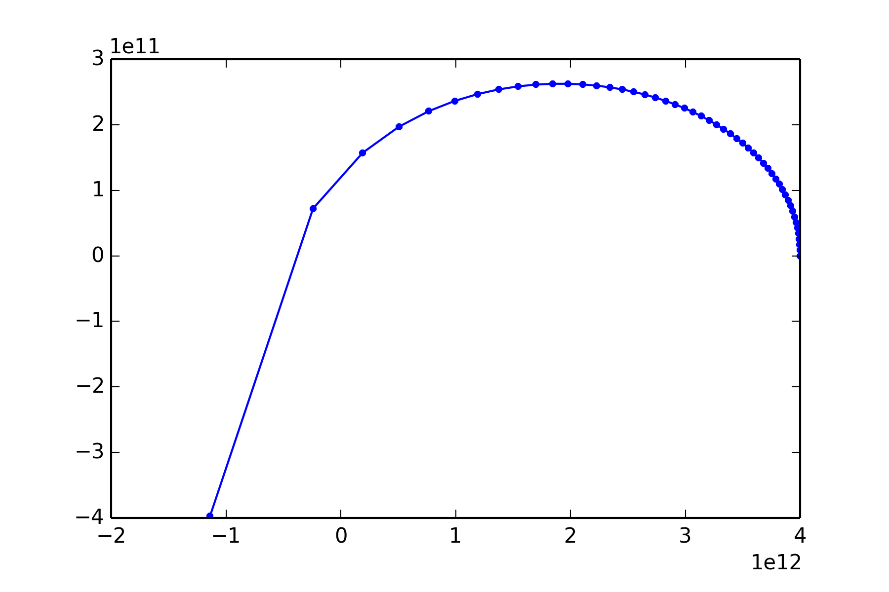
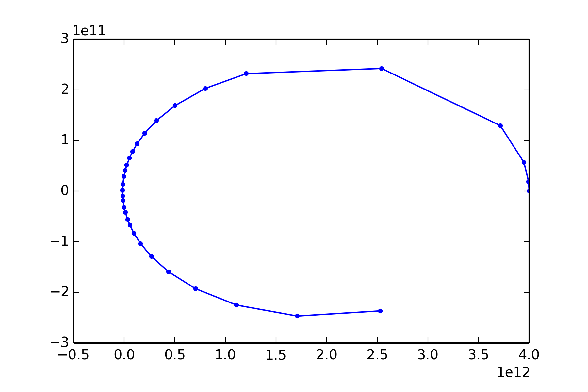
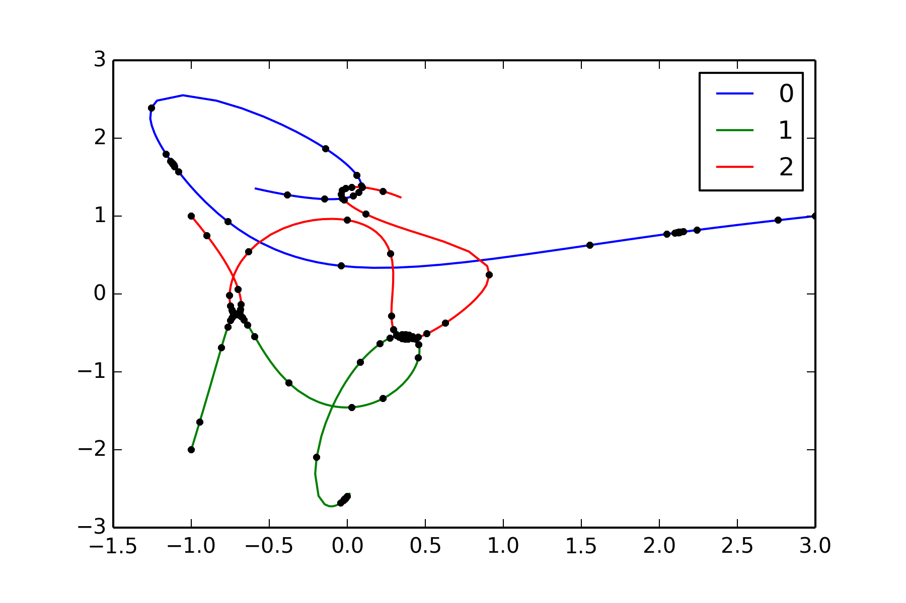

% Divu un trīs ķermeņu problēmas skaitliskā risināšana
% Jānis Erdmanis
% 2013. gada 30. Novembris

# Zeme-Saule problēmas formulējums

+ Var izmantot $F=ma$ ar $F = G \frac{mM}{r^2}$, bet, lai ietu tālāk, izmantosim Lagranža formālismu

Atskaites sistēmas centru novietojam saules centrā, tādēļ:

$$L = T - V=\frac{1}{2} m (\dot x^2 + \dot y ^2) - (- G \frac{mM}{\sqrt(x^2 + y^2)} )$$

+ Pieprasam tādas trajektoriju kurai ar šo Lagranža funkciju būs mazākā akcija:

Tad atbilstošie Eilera-Lagranža vienādojumi (vispārinājums vienas koordinātes gadijumam):

$$\frac{d}{dt} \frac{\partial L}{\partial \dot x} = \frac{\partial L}{\partial_x}$$

$$\frac{d}{dt} \frac{\partial L}{\partial \dot y} = \frac{\partial L}{\partial_y}$$

kur piemēram atvasinājumi:

$$\frac{\partial L}{\partial x} = - \frac{\partial V}{\partial x} = G m M \frac{\partial}{\partial x} \frac{1}{\sqrt{x^2 + y^2}}$$

$$\frac{d}{dt} \frac{\partial L}{\partial \dot x} = m \ddot x$$

+ Veidojam vienādojumu sistēmu:

$$
\dot x = n \\
\dot n = \ddot x \\
\dot y = m \\
\dot m = \ddot y
$$

# Zeme-Saule risināšana ar nemainīgu soli $h$ 
		
		solution = []
		time = []
		solution.append(copy(r))
		time.append(t)

		# Kamēr apskatītais laika moments
		# nav lielāks par beigu laiku
		while t<b:

			# Vieta, kur mainīt soļa izmēru
			# un novērtēt soļa precizitāti
			r1 = r + self.estimate_delta_euler(r,t,h)

			# Noraidīt vai apstiprināt iegūto r1 vērtību
			if True:
				t +=h
				r = r1
				solution.append(copy(r))
				time.append(t)

		self.solution = array(solution)
		self.t = array(time)

# Adaptīvā Zeme-Saule risināšana

		solution = []
		time = []
		solution.append(copy(r))
		time.append(t)

		# Kamēr apskatītais laika moments
		# nav lielāks par beigu laiku
		while t<b:
			# Vieta, kur mainīt soļa izmēru

			if ro<2:
				h = h*ro**(1/4)
			else:
				h*=2

			# un novērtēt soļa precizitāti
			r1 = r + self.estimate_delta_rk4(r,t,h)
			r1 += self.estimate_delta_rk4(r1,t+h,h)
			r2 = r + self.estimate_delta_rk4(r,t,2*h)
			
			# Novērtē attālumu starp vektoriem r1 un r2 un veic izvēli
			difference = r1 - r2
			ro = 30*h*delta/sqrt(difference[0]**2 + difference[1]**2)

			# Noraidīt vai apstiprināt iegūto r1 vērtību
			if ro>1:
				t +=2*h
				r = r1
				solution.append(copy(r))
				time.append(t)

		self.solution = array(solution)
		self.t = array(time)

# Trīs ķermeņu problēma

+ No Zeme-Saule aprēķinu algoritma atšķirās tikai ar attāluma noteikšanu starp vektoriem *r1* un *r2*, kas tiek vispārināts
	
+ Trajektorijas vienādojumus var iegūt no Lagranža funkcijas:

$$L &= \sum_i \frac{1}{2} m_i v_i^2  -  \sum_{n>m} V_{nm} \\
&=  \sum_i \frac{1}{2} m_i v_i^2 + V_{21} + V_{31} + V_{32}
$$

kur potenciāls:

$$V_{nm} = G \frac{m_n m_m}{|r_n - r_m|}$$

	- Raksta *Eilera-Lagranža* vienādojumus vispārinātā formā:
		
		$$\frac{d}{dt} \frac{\partial L}{\partial \dot x_i} = \frac{\partial L}{\partial x_i}$$
	
	**Šajā vienādojumā *i* ir jebkuras daļiņas koordināte!**

	- Iegūst 6 otrās kārtas vienādojumus

	 

